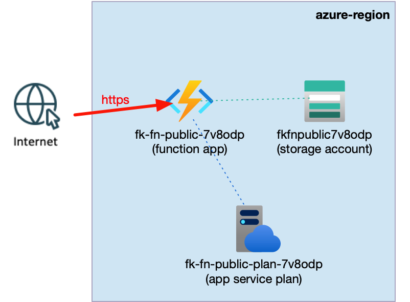
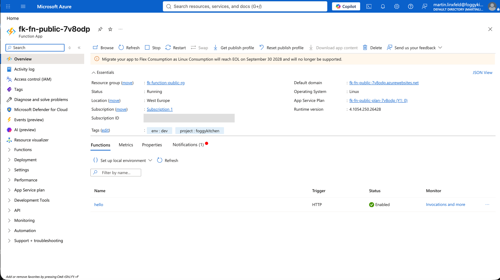
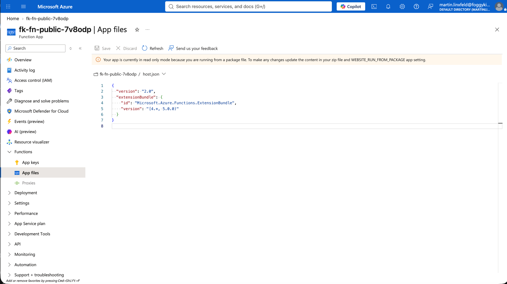
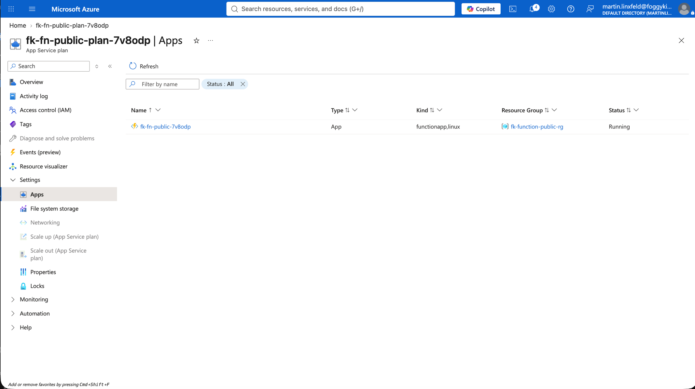
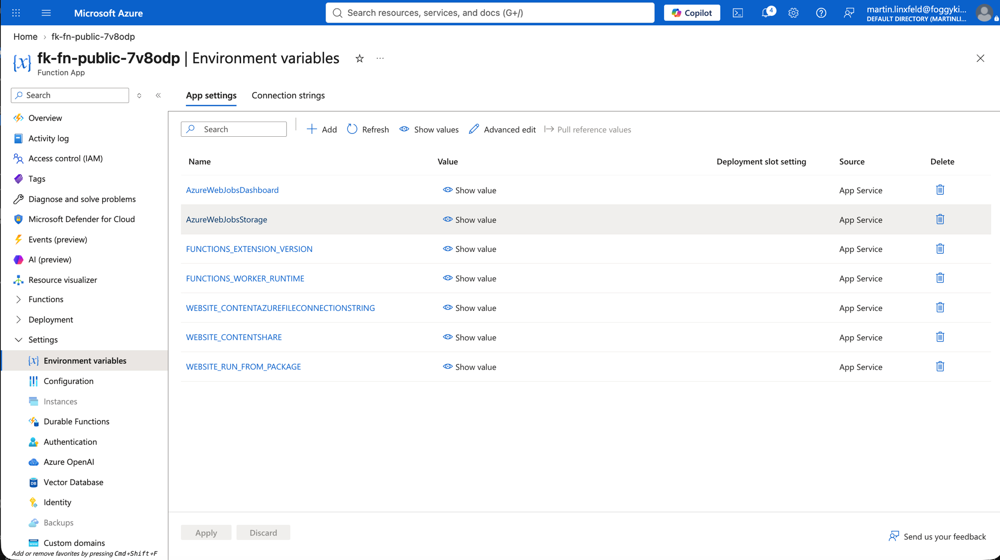
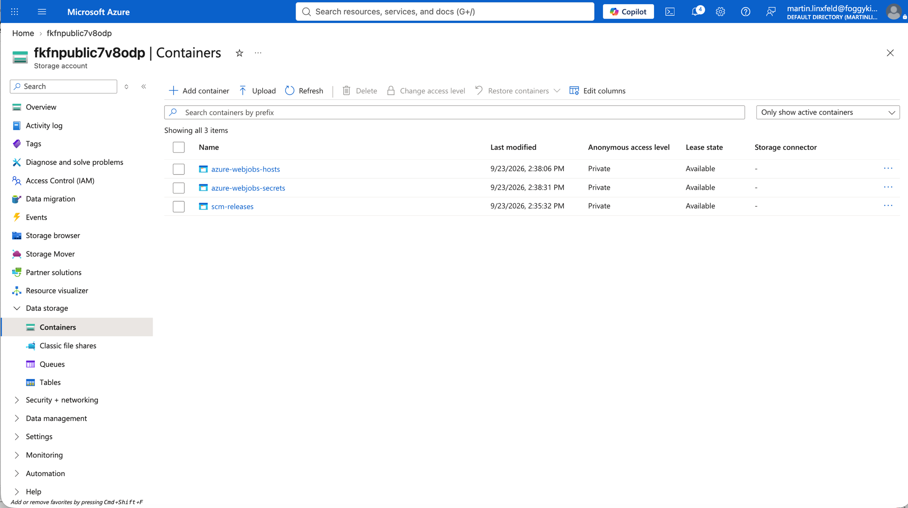

# Example 01: Public HTTP Function

In this Azure Functions example, we deploy a **Python HTTP-triggered Function App** using **Terraform/OpenTofu** and package the function source as a ZIP.
The Function App runs on a Linux Consumption plan and uses an Azure Storage Account supplied by the FoggyKitchen Storage module.

This example focuses on the smallest complete code-first deployment path: host infrastructure, required runtime storage, Python source packaging, and a public HTTPS endpoint.

---

## Architecture Overview



This deployment creates:

- A dedicated **Azure Resource Group**
- One **Storage Account** using `terraform-az-fk-storage`
- One Linux **Consumption Service Plan** using the local module
- One Linux **Function App** using the local module
- One Python v2 programming-model HTTP trigger
- One ZIP package generated from the example's `function/` directory

The Python function does not read or write blobs. Azure Functions still requires the Storage Account for host state, trigger coordination, scaling metadata, and runtime operations.

---

## Access Layout

- **Hosting plan:** Linux Consumption (`Y1`)
- **Runtime:** Python `3.12`
- **Functions host:** `~4`
- **HTTP route:** `/api/hello`
- **Authorization level:** anonymous
- **Public network access:** enabled
- **Storage authentication:** access key passed as a sensitive module output

No credential or Storage Account key is stored in `terraform.tfvars`.

---

## Deployment Steps

Copy the example variables file:

```bash
cp terraform.tfvars.example terraform.tfvars
```

The file contains only the resource group name and Azure region. It requires no password, token, or API key.

Initialize and apply the Terraform/OpenTofu configuration:

```bash
tofu init
tofu plan
tofu apply
```

After a successful deployment, OpenTofu will output the Function App ID, name, complete public function URL, and host Storage Account name.

---

## Runtime Notes

The `archive_file` data source creates `function.zip` locally. The module sends that package through `zip_deploy_file` and sets `WEBSITE_RUN_FROM_PACKAGE = "1"`.

```bash
curl -i "$(tofu output -raw function_url)?name=FoggyKitchen"
```

Expected response:

```text
HTTP/1.1 200 OK
Content-Type: text/plain; charset=utf-8

Hello, FoggyKitchen!
```

### Verified Runtime Test

The example was deployed and tested against Azure on 2026-09-23. The generated Function App endpoint returned:

```text
HTTP/1.1 200 OK
Server: Kestrel

Hello, FoggyKitchen!
```

This verifies the complete path: infrastructure provisioning, host Storage connectivity, ZIP deployment, Python function discovery, and public HTTP invocation.

This example intentionally does not create Event Grid, Service Bus, API Management, or CI/CD resources.

---

## Azure Console And Runtime Verification

### Function App Overview

Verify that the Function App runs on Linux, uses the expected Consumption plan, and reports the Python runtime stack.



### Function Discovery

Confirm that the `hello` HTTP trigger was discovered from the deployed ZIP package.

The App files view also confirms that Azure is running the immutable ZIP package and exposes the deployed `host.json` configuration.



### App Service Plan

Confirm that the Consumption Service Plan contains the Linux Function App and that the app is running.



### Host Storage

Confirm that the app references the Storage Account created by `terraform-az-fk-storage`. The Python code does not need the Storage SDK for this host dependency to be required.

The Function App environment variables expose the Storage integration setting names while keeping their connection-string values hidden.



The Storage Account contains runtime-managed containers such as `azure-webjobs-hosts`, `azure-webjobs-secrets`, and `scm-releases`, demonstrating that the Functions host actively uses the account.



---

## Cleanup

```bash
tofu destroy
```

---

## Summary

This example demonstrates:

- Linux Consumption Function App deployment
- Python HTTP-trigger ZIP deployment
- Composition with `terraform-az-fk-storage`
- The distinction between Functions host storage and application data access
- A public serverless endpoint without secrets in configuration files

---

## Learn More

Visit [FoggyKitchen.com](https://foggykitchen.com/) for Azure, OCI, multicloud, and Terraform/OpenTofu learning resources.

---

## License

Licensed under the **Universal Permissive License (UPL), Version 1.0**.
See [LICENSE](../../LICENSE) for more details.

---

© 2026 [FoggyKitchen.com](https://foggykitchen.com) - Cloud. Code. Clarity.
