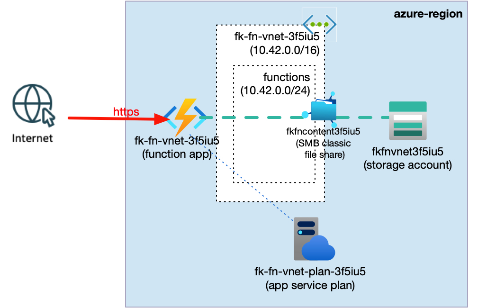
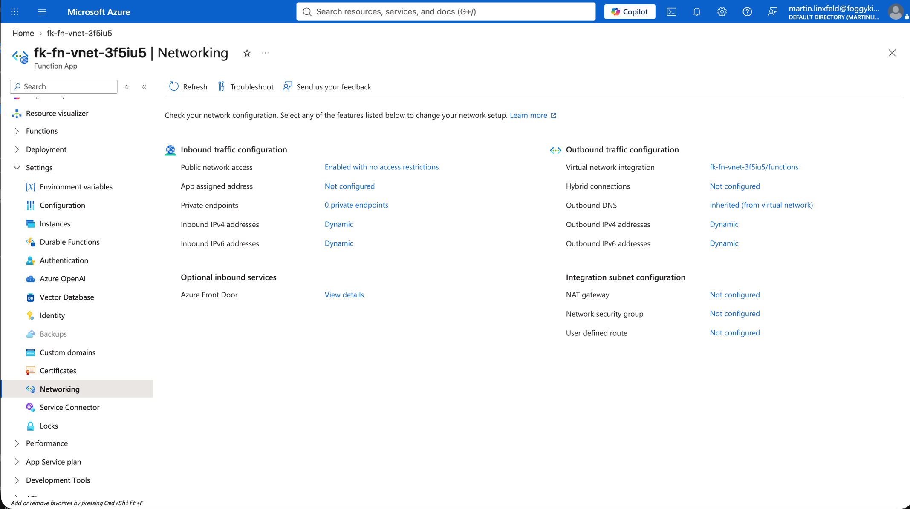
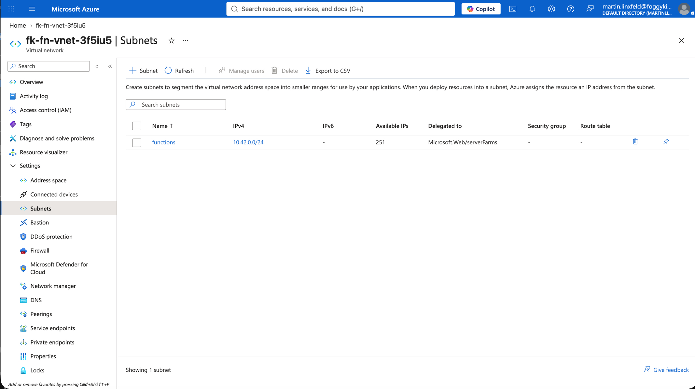
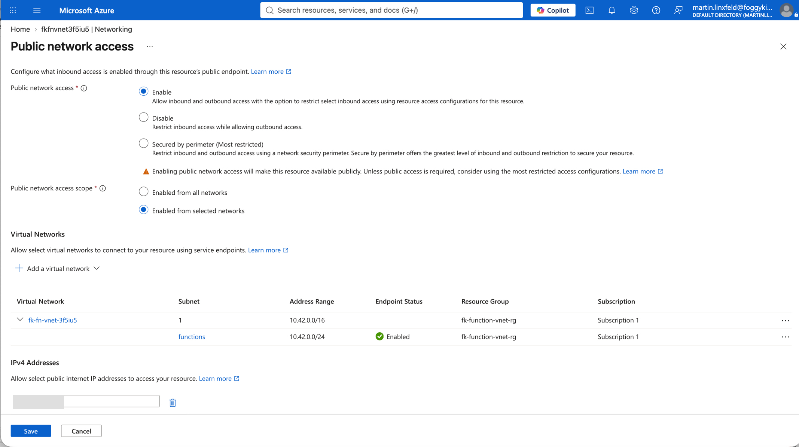
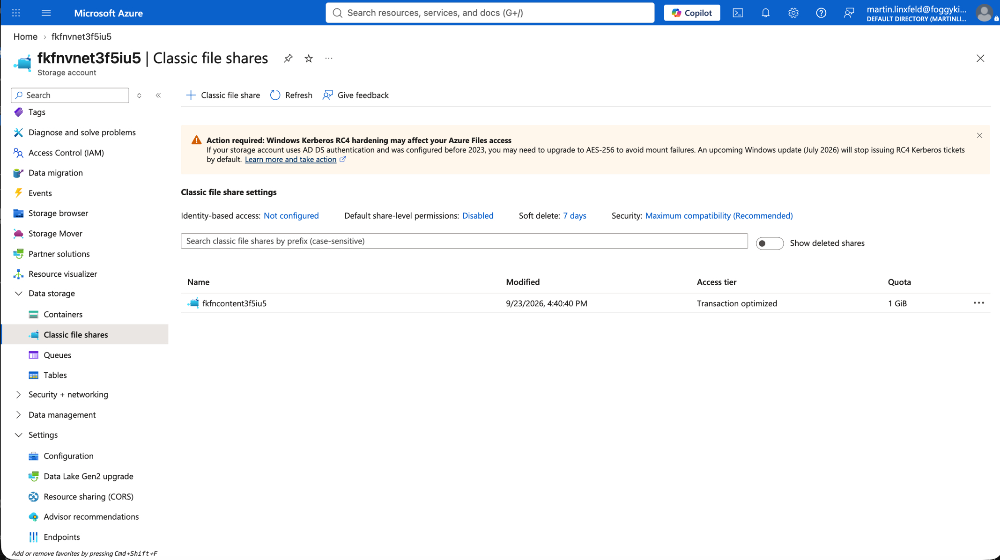
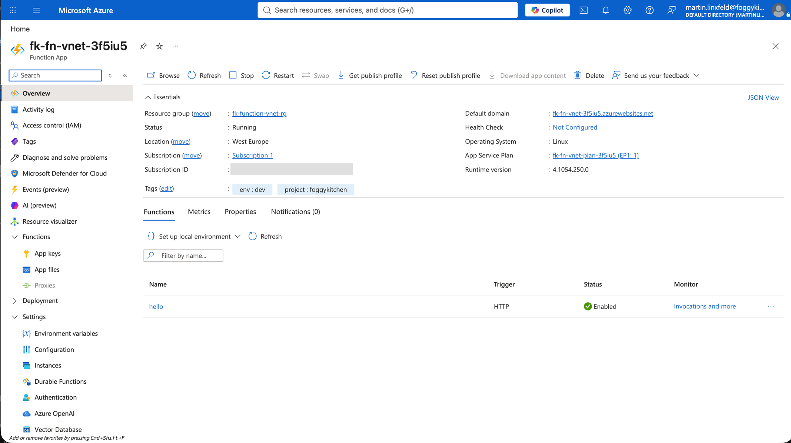

# Example 02: Internal VNet Integration

In this Azure Functions example, we deploy a **Python HTTP-triggered Function App** on an Elastic Premium plan and integrate its outbound traffic with a delegated Azure subnet.
The required Storage Account is restricted with network rules and composed through the FoggyKitchen Storage module.

This example focuses on the **regional VNet integration path** while keeping Private Endpoint ownership outside the root module.

---

## Architecture Overview



This deployment creates:

- A dedicated **Azure Resource Group**
- One **Azure VNet** using `terraform-az-fk-vnet`
- One subnet delegated to `Microsoft.Web/serverFarms`
- A Storage service endpoint on the delegated subnet
- One network-restricted **Storage Account** using `terraform-az-fk-storage`
- One Azure Files content share used by the Elastic Premium Functions host
- One Linux **Elastic Premium Service Plan** (`EP1`)
- One VNet-integrated Linux **Function App**
- One ZIP-deployed Python HTTP trigger

VNet integration is an outbound feature. It does not place the Function App itself inside the subnet and does not create a private inbound endpoint.

---

## Network Layout

- **VNet CIDR:** `10.42.0.0/16`
- **Functions integration subnet:** `10.42.0.0/24`
- **Subnet delegation:** `Microsoft.Web/serverFarms`
- **Service endpoint:** `Microsoft.Storage`
- **Storage default network action:** `Deny`
- **Operator deployment access:** the public IPv4 address supplied as `my_public_ip`
- **Functions outbound routing:** route all enabled
- **Premium content share routing:** `WEBSITE_CONTENTOVERVNET = 1`

For private inbound access, compose `terraform-az-fk-private-endpoint` and `terraform-az-fk-private-dns` in a higher-level example or blueprint.

---

## Deployment Steps

```bash
cp terraform.tfvars.example terraform.tfvars
# Replace the documentation-only my_public_ip value with your current public IPv4 address.
tofu init
tofu plan
tofu apply
```

No secret is required. `my_public_ip` is a network allowlist value, not a credential. The Storage Account key flows as a sensitive output directly between the FoggyKitchen Storage module and the Function module.

After deployment, OpenTofu outputs the Function App ID, name and hostname, plus the delegated Functions subnet ID.

---

## Runtime Notes

Elastic Premium provides a production-oriented VNet integration baseline. The Python function remains intentionally small so the example isolates networking behavior from application complexity.

Because an Elastic Premium Function App uses an Azure Files content share, the example creates that share through `terraform-az-fk-storage` and passes its name through `WEBSITE_CONTENTSHARE`. It also sets `WEBSITE_CONTENTOVERVNET = "1"` and enables the ARM `vnetContentShareEnabled` site property through the root module. AzureRM 4.81 does not expose that property on `azurerm_linux_function_app`, so the root module uses AzAPI for this narrow provider gap.

The Storage Account firewall is applied only after the Function App, content-share routing and ZIP deployment are ready. This ordering is required on the first deployment: closing Storage before Kudu initializes causes ZIP deployment to wait indefinitely. The final state remains `default_action = "Deny"`, with only the Functions subnet and operator IP allowlisted.

The HTTP endpoint remains public. The functional change from Example 01 is the outbound network path and the host Storage Account boundary—not an inbound Private Endpoint.

### Verified Runtime And Network Test

The example was deployed and tested against Azure on 2026-09-23. The generated Function App endpoint returned:

```text
HTTP/1.1 200 OK
Content-Type: text/plain; charset=utf-8
Server: Kestrel

Hello from the VNet-integrated function!
```

The final Storage Account firewall and Functions content-share routing were also verified:

```text
Storage network default action: Deny
Function App vnetContentShareEnabled: true
```

This verifies the complete path: ZIP deployment, Python function discovery, public HTTP invocation, outbound VNet integration, access to the network-restricted host Storage Account, and Azure Files content-share routing through the integrated subnet.

---

## Azure Console And Runtime Verification

### Function App Networking

Confirm regional VNet integration with the `functions` subnet.



### Delegated Subnet

Verify delegation to `Microsoft.Web/serverFarms` and the `Microsoft.Storage` service endpoint.



### Storage Network Rules

Confirm that the Storage Account default action is `Deny`, the Functions subnet is allowed, and the operator public IP is temporarily allowlisted for ZIP deployment and verification from the workstation.



### Functions Content Share

Confirm that the module-created `fkfncontent...` Azure Files share is present for the Elastic Premium Functions host.



### Function Runtime

Call `/api/hello` and expect: `Hello from the VNet-integrated function!`

The Function App overview should show the app as running and the `hello` HTTP trigger as enabled.



---

## Cleanup

```bash
tofu destroy
```

---

## Summary

This example demonstrates:

- Composition with `terraform-az-fk-vnet` and `terraform-az-fk-storage`
- App Service subnet delegation
- Network-restricted Functions host storage
- Routing Function App outbound traffic through a VNet
- The boundary between VNet integration and Private Endpoint connectivity

---

## Learn More

Visit [FoggyKitchen.com](https://foggykitchen.com/) for Azure, OCI, multicloud, and Terraform/OpenTofu learning resources.

---

## License

Licensed under the **Universal Permissive License (UPL), Version 1.0**.
See [LICENSE](../../LICENSE) for more details.

---

© 2026 [FoggyKitchen.com](https://foggykitchen.com) - Cloud. Code. Clarity.
