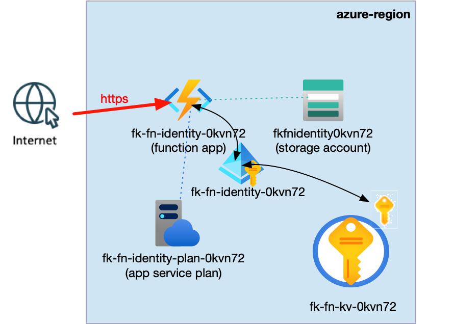
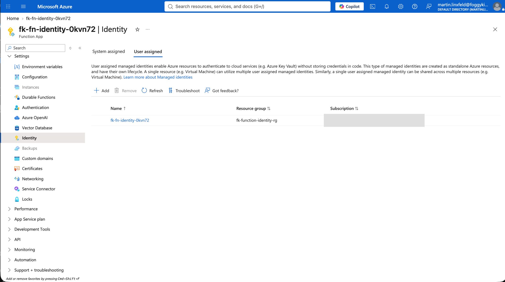
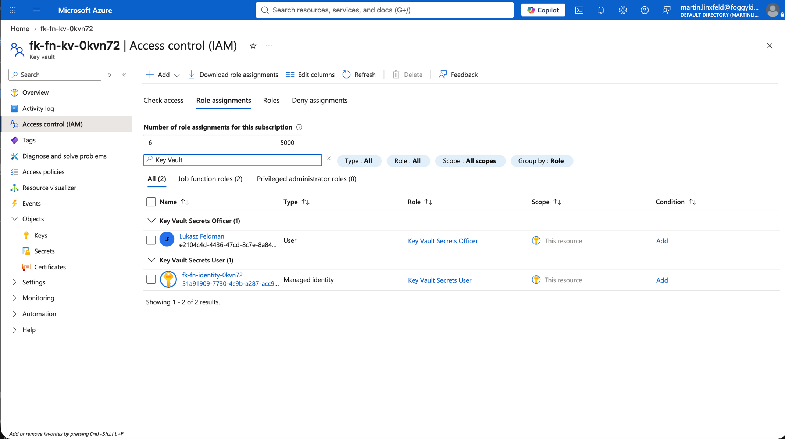
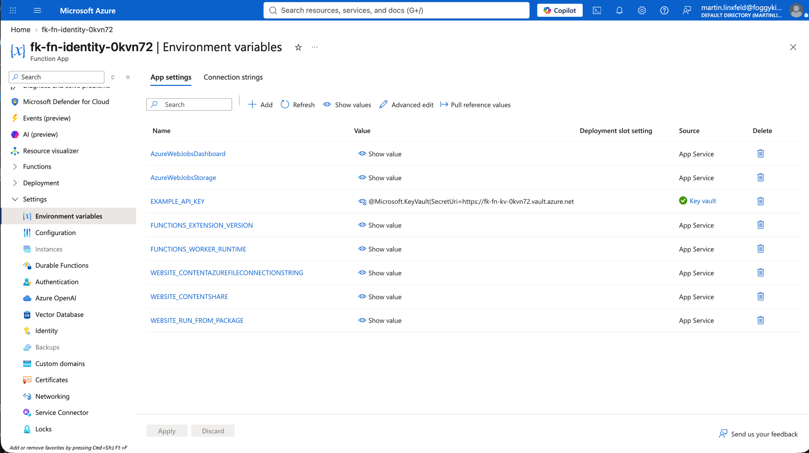
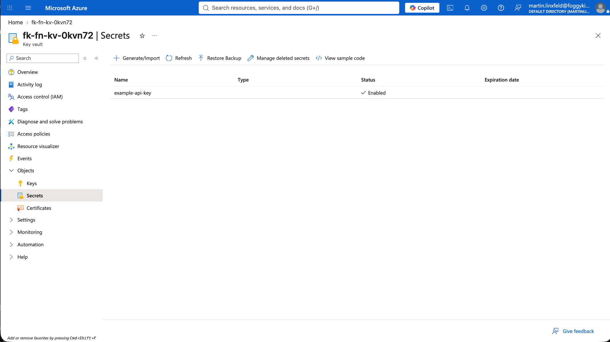
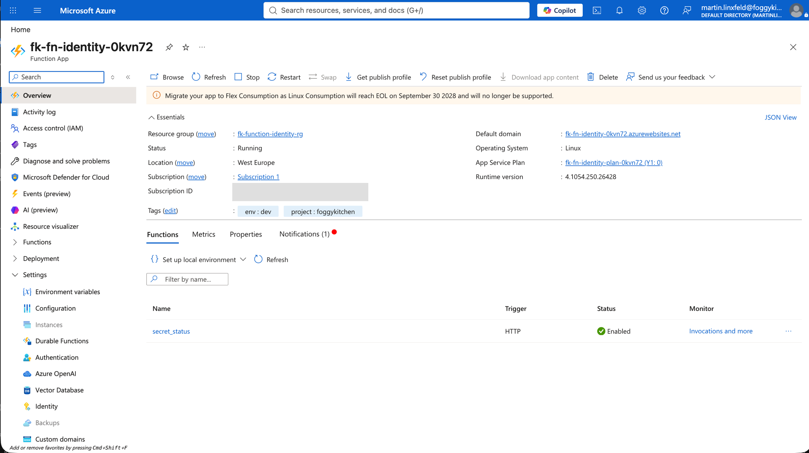

# Example 03: Managed Identity and Key Vault

In this Azure Functions example, we deploy a **Python HTTP-triggered Function App** with a user-assigned managed identity and resolve an application setting from Azure Key Vault.
FoggyKitchen modules create the Storage Account, Managed Identity, RBAC assignments, and Key Vault; the Function App receives only a Key Vault reference.

This example focuses on the **secret delivery path** used when function code must consume an API key, connection string, partner token, or signing key without storing it in source code or `terraform.tfvars`.

---

## Architecture Overview



```text
HTTP client
    |
    v
Linux Function App
    |
    | user-assigned managed identity
    v
Key Vault -- EXAMPLE_API_KEY reference
    |
    +-- Key Vault Secrets User RBAC

Functions host Storage Account
    (terraform-az-fk-storage)
```

This deployment creates:

- A dedicated **Azure Resource Group**
- One **Storage Account** using `terraform-az-fk-storage`
- One **User Assigned Managed Identity** using `terraform-az-fk-managed-identity`
- One **Key Vault** using `terraform-az-fk-key-vault`
- A `Key Vault Secrets User` assignment using `terraform-az-fk-rbac`
- A deployer `Key Vault Secrets Officer` assignment using `terraform-az-fk-rbac`
- One generated demonstration secret stored in Key Vault
- One Linux Consumption **Function App** using the managed identity
- One Key Vault-referenced `EXAMPLE_API_KEY` application setting

The generated value is sensitive state data. It is never hardcoded, printed by the function, or requested through `terraform.tfvars`.

---

## Identity And Secret Layout

- **Function identity:** user-assigned managed identity
- **Function data-plane role:** `Key Vault Secrets User`
- **Deployment data-plane role:** `Key Vault Secrets Officer`
- **Application setting:** `EXAMPLE_API_KEY`
- **Setting value:** `@Microsoft.KeyVault(SecretUri=...)`
- **Runtime consumption:** `os.getenv("EXAMPLE_API_KEY")`
- **Storage authentication:** access key passed as a sensitive module output

The Function App uses `key_vault_reference_identity_id` so Azure resolves the reference with the user-assigned identity.

---

## Deployment Steps

```bash
cp terraform.tfvars.example terraform.tfvars
tofu init
tofu plan
tofu apply
```

Do not add an API key or password. The example generates a demonstration value and stores it directly in Key Vault.

Azure RBAC data-plane propagation can take several minutes. If authorization initially fails immediately after role creation, wait and retry.

OpenTofu outputs the Function App, identity and Key Vault identifiers. The versionless secret ID is marked sensitive.

---

## Runtime Notes

Call the verification endpoint:

```bash
curl "https://<function-hostname>/api/secret-status"
```

Expected response: `Key Vault reference resolved: True`

The endpoint never returns the secret. A real workload can use the same environment value for an outbound API call, database connection, message publisher, or cryptographic operation.

### Verified Runtime Test

The example was deployed and tested against Azure on 2026-09-23. The generated endpoint returned:

```text
HTTP/1.1 200 OK
Content-Type: text/plain; charset=utf-8
Server: Kestrel

Key Vault reference resolved: True
```

The Function App configuration was also verified to contain a versionless `@Microsoft.KeyVault(SecretUri=...)` reference rather than the generated secret value.

---

## Azure Console And Runtime Verification

### Managed Identity

Confirm that the user-assigned identity is attached and selected as the Key Vault reference identity.



### Key Vault RBAC

Verify that the identity has `Key Vault Secrets User` at the Key Vault scope.



### Function App Configuration

Inspect `EXAMPLE_API_KEY`. Azure should show a Key Vault reference and a resolved status after RBAC propagation.



### Key Vault Secret

Confirm that `example-api-key` exists and is enabled without opening or displaying its confidential value.



### Runtime Endpoint

Call `/api/secret-status` and confirm success without revealing the confidential value.

The Function App overview should show the app as running and the `secret_status` HTTP trigger as enabled.



---

## Cleanup

```bash
tofu destroy
```

---

## Summary

This example demonstrates:

- Composition with FoggyKitchen Managed Identity, RBAC, Key Vault, and Storage modules
- Least-privilege Key Vault secret access
- Runtime secret delivery without Python or `terraform.tfvars` plaintext
- Key Vault reference resolution into an application setting
- Secret availability verification without disclosure

---

## Learn More

Visit [FoggyKitchen.com](https://foggykitchen.com/) for Azure, OCI, multicloud, and Terraform/OpenTofu learning resources.

---

## License

Licensed under the **Universal Permissive License (UPL), Version 1.0**.
See [LICENSE](../../LICENSE) for more details.

---

© 2026 [FoggyKitchen.com](https://foggykitchen.com) - Cloud. Code. Clarity.
